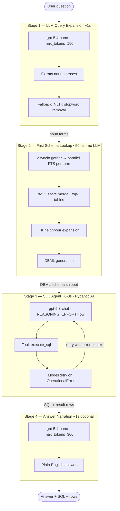

# agentic-text2sql

A fast, self-correcting Natural Language → SQL pipeline built with **[Pydantic AI](https://ai.pydantic.dev/)** as the agent orchestration framework and **Azure OpenAI** as the model backend.

- **~8 seconds** end-to-end latency on a 10-table e-commerce schema
- **Self-correcting SQL** via `ModelRetry` on `OperationalError`
- **Zero LLM cost** for schema lookup — pure-Python FTS replaces the schema agent
- **Two-model routing**: a nano model for cheap tasks, a full model only for SQL generation

---

## Architecture



---

## Quick Start

### Prerequisites

- Python ≥ 3.11
- [uv](https://github.com/astral-sh/uv)
- Azure OpenAI access with `gpt-5.4-nano` and `gpt-5.3-chat` deployed

### Install

```bash
git clone https://github.com/your-org/agentic-text2sql
cd agentic-text2sql
uv sync
```

### Configure

```bash
cp .env.example .env
```

Edit `.env` with your Azure credentials:

```env
AZURE_OPENAI_ENDPOINT=https://<your-resource>.cognitiveservices.azure.com/
AZURE_OPENAI_API_KEY=<your-key>
OPENAI_API_VERSION=2024-12-01-preview
```

### Seed and Index

```bash
# Populate meta-schema (table + column descriptions)
uv run python cli.py seed-meta

# Insert dummy e-commerce rows
uv run python cli.py seed-data

# Build FTS5 search index
uv run python cli.py build-fts
```

### Ask a Question

```bash
uv run python cli.py ask "Which products are in the Electronics category?"

# With verbose pipeline output
uv run python cli.py ask "Top 5 customers by lifetime spend" --verbose

# SQL only, no narration
uv run python cli.py ask "How many orders were placed last month?" --no-narrate
```

---

## CLI Reference

| Command | Description |
|---|---|
| `seed-meta` | Populate meta-schema with e-commerce table/column descriptions |
| `seed-data` | Insert dummy e-commerce rows into the data schema |
| `build-fts` | Create / refresh FTS5 virtual tables |
| `search <query>` | Run BM25 FTS and print matching tables/columns with scores |
| `ask <question>` | Run the full Text2SQL pipeline |
| `dbml export` | Print DBML schema to stdout |

---

## Environment Variables

| Variable | Default | Description |
|---|---|---|
| `AZURE_OPENAI_ENDPOINT` | — | Azure OpenAI resource endpoint |
| `AZURE_OPENAI_API_KEY` | — | API key |
| `OPENAI_API_VERSION` | — | API version (e.g. `2024-12-01-preview`) |
| `FAST_MODEL` | `gpt-5.4-nano` | Model for query expansion and narration |
| `SQL_MODEL` | `gpt-5.3-chat` | Model for SQL generation |
| `ANSWER_MODEL` | `$FAST_MODEL` | Model for answer narration (defaults to FAST_MODEL) |
| `REASONING_EFFORT` | `low` | `low` / `medium` / `high` — controls chain-of-thought |
| `MAX_TOKENS_SQL` | `1024` | Token cap for SQL agent output |
| `MAX_TOKENS_ANSWER` | `300` | Token cap for narration output |
| `DB_URL` | `sqlite:///./text2sql.db` | SQLAlchemy database URL |

---

## Model Routing

| Task | Model | Why |
|---|---|---|
| Query expansion (noun extraction) | `gpt-5.4-nano` | Simple extraction, ~150 tokens |
| Answer narration | `gpt-5.4-nano` | Templated prose, low stakes |
| SQL generation + execution | `gpt-5.3-chat` | Needs full reasoning, self-correction |

The schema lookup stage uses **no LLM** — it runs pure-Python BM25 FTS via SQLite FTS5.

---

## Eval Results

Tested on 10 Natural Language → SQL examples covering:
`simple_filter`, `aggregation`, `multi-table join`, `subquery`, `window function`, `CTE`

| Metric | Value |
|---|---|
| Average score | 92.7 / 100 |
| Average latency | ~8s |
| Self-correcting retries | ModelRetry on OperationalError |

Run the eval yourself:

```bash
uv run python eval/run_eval.py
# Results written to eval/eval_results.jsonl
```

---

## Project Structure

```
agentic-text2sql/
├── cli.py                          # Typer CLI entry point
├── pyproject.toml
├── .env                            # Azure credentials (not committed)
├── eval/
│   ├── eval_examples.jsonl         # 10 NL→SQL test cases
│   └── run_eval.py                 # LLM-as-judge eval runner
├── tests/
│   ├── conftest.py
│   ├── test_dbml_gen.py
│   ├── test_fts.py
│   └── test_retrieval.py
└── text2sql_mvp/app/
    ├── text2sql.py                 # Pipeline — main entry point
    ├── fts.py                      # FTS5 index build + BM25 search
    ├── dbml_gen.py                 # DBML schema generation
    ├── meta_schema.py              # FK neighbour expansion, table registry
    ├── retrieval.py                # Legacy LLM retrieval (unused in pipeline)
    ├── seed_meta.py                # E-commerce schema definitions
    ├── seed_data.py                # Dummy data rows
    ├── db.py                       # SQLAlchemy engine factory
    ├── data_schema.py              # SQLAlchemy table models
    └── log.py                      # ANSI colour logging
```

---

## Running Tests

```bash
uv run pytest
```

All 29 tests run against an in-memory SQLite database and do not require Azure credentials.

---

## How Self-Correction Works

The SQL agent is given an `execute_sql` tool. When the generated SQL raises a `sqlalchemy.exc.OperationalError` (e.g. wrong column name, bad syntax), the tool raises `ModelRetry` with the error message. pydantic-ai automatically re-prompts the model with the full error context, allowing it to fix the SQL without any manual retry logic.

```python
@sql_agent.tool
async def execute_sql(ctx: RunContext[PipelineDeps], sql: str) -> str:
    try:
        result = conn.execute(text(sql))
        ctx.deps.rows = [dict(row) for row in result]
        return json.dumps(ctx.deps.rows[:5], default=str)
    except OperationalError as e:
        raise ModelRetry(f"SQL error: {e}\nSchema:\n{ctx.deps.dbml}") from e
```

---

## Appendix — Research Directions for Improving Agentic Text2SQL

The current pipeline scores ~92.7/100 on 10 eval queries with ~8s latency. The main bottleneck is the **one-shot BM25 retrieval** in Stage 2 — it's fast (<50ms) but fragile: keyword mismatches ("revenue" won't match `total_amount`), no semantic understanding, and fixed top-3 table selection. Below are 5 research directions, prioritized by expected impact.

### Current Pipeline Weaknesses (from code analysis)

1. **BM25 keyword mismatch** — FTS5 matches literal tokens. Lemmatization helps but doesn't bridge synonyms.
2. **Fixed top-k=3 tables** — Simple queries may need 1 table; complex queries may need 5+.
3. **No column-level precision** — DBML dumps ALL columns for matched tables, increasing prompt noise.
4. **No retrieval feedback loop** — On SQL failure, `ModelRetry` re-prompts the agent with the *same* schema. If a table/column is missing from the DBML, it can never self-correct.
5. **Flat query expansion** — LLM extracts nouns but doesn't reason about relationships or domain semantics.

### Direction 1: Hierarchical Retrieval

Replace the single-pass BM25 with a multi-level cascade:

- **Level 1 — Coarse**: BM25 over `table_registry` → top-5 candidate tables (broad recall)
- **Level 2 — Fine-grained**: For each candidate, BM25/semantic search over its `column_registry`. Prune tables whose best column score is below a threshold.
- **Level 3 — Relationship expansion**: FK-walk from surviving tables, but only add neighbors if they contribute relevant columns (not blind expansion like today)
- **Level 4 — Schema assembly**: Generate DBML with relevant columns annotated or irrelevant ones pruned

**Files**: `retrieval.py`, `fts.py`, `dbml_gen.py`

### Direction 2: Hybrid Retrieval (BM25 + Embeddings)

Add a dense embedding index alongside BM25 for semantic matching.

- Embed `search_doc` for each table/column at seed time (e.g. `text-embedding-3-small` or local `sentence-transformers`)
- At query time, fuse BM25 scores with cosine similarity via Reciprocal Rank Fusion (RRF)
- Directly fixes the synonym problem: "revenue" will be semantically close to "total_amount"
- Can use `sqlite-vec` extension for in-process vector search (no new infra)

**Files**: New `embedding.py`, modify `fts.py`, `retrieval.py`, `meta_schema.py`

### Direction 3: Retrieval-Augmented Self-Correction (Closed-Loop Retrieval)

When the SQL agent fails with "no such table/column", feed the error back to **retrieval**, not just the SQL agent.

- Parse `OperationalError` messages for missing entities
- Trigger a **targeted re-retrieval** for that specific table/column
- Expand the DBML and re-run the SQL agent with enriched context

**Files**: `text2sql.py`, `retrieval.py`

### Direction 4: Schema-Aware Query Decomposition

For complex questions, decompose into sub-questions, retrieve schema per sub-question, then compose.

Example: *"Average order value for customers in New York who bought Electronics"*
- Sub-Q1: "customers in New York" → `users` (city)
- Sub-Q2: "Electronics products" → `products` (category)
- Sub-Q3: "average order value" → `orders` (total_amount)
- Compose: verify JOIN paths exist via FK graph

**Files**: `retrieval.py`, `text2sql.py`

### Direction 5: Few-Shot Example Retrieval

Retrieve similar previously-successful NL→SQL pairs as few-shot examples for the SQL agent.

- Build an example bank from eval/production runs: (question, SQL, score)
- At query time, embed the question → find top-2 nearest examples → inject into system prompt
- Proven technique in text2sql literature; especially helps with CTEs, window functions

**Files**: New `example_store.py`, modify `text2sql.py`

### Recommended Priority

| Priority | Direction | Expected Gain | Complexity | Latency Impact |
|----------|-----------|---------------|------------|----------------|
| 1 | **Hierarchical Retrieval** | Medium-high | Medium | +10-20ms |
| 2 | **Hybrid BM25+Embeddings** | High | Medium | +50-100ms |
| 3 | **Few-Shot Example Retrieval** | Medium-high | Low-medium | +100-200ms |
| 4 | **Closed-Loop Retrieval** | Medium | Low | +0ms (only on retry) |
| 5 | **Query Decomposition** | High (complex Qs) | High | +1-2s |

**Recommendation**: Start with **Direction 1** (hierarchical retrieval) — it improves the existing BM25 pipeline with no new dependencies. Then layer **Direction 2** (embeddings) on top for semantic matching. **Direction 4** (closed-loop retrieval) is a quick parallel win.

### Verification

1. **Expand eval set** from 10 → 25-30 examples: add synonym-heavy queries, ambiguous column references, 4+ table joins, date arithmetic, negation queries
2. **Add retrieval-specific metrics**: Table Recall@k, Column Precision — measure retrieval quality independently from SQL generation
3. **A/B comparison**: Run old vs. new retrieval on same eval set, compare scores and latency
4. **Track retrieval latency** separately from end-to-end latency
